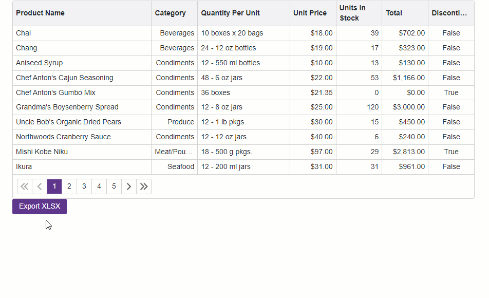

<!-- default badges list -->

<!-- default badges end -->
# Grid for Blazor - How to customize export settings

This example demonstrates how to export [DevExpress Blazor Grid](https://docs.devexpress.com/Blazor/403143/grid) data to an XLSX file and customize the export result.

## Overview

Set a column's [ExportEnabled](https://docs.devexpress.com/Blazor/DevExpress.Blazor.DxGridDataColumn.ExportEnabled) property to `false` to prevent the Grid from exporting this column. To export data to an XLSX file, call the Grid's [ExportToXlsxAsync](https://docs.devexpress.com/Blazor/DevExpress.Blazor.DxGrid.ExportToXlsxAsync(System.String-DevExpress.Blazor.GridXlExportOptions)) method. The method accepts a [GridXlExportOptions](https://docs.devexpress.com/Blazor/DevExpress.Blazor.GridXlExportOptions) object as a parameter. Specify the parameter's properties to set up export settings.

The code example sets the following `GridXlExportOptions` properties:

**[CustomizeCell](https://docs.devexpress.com/Blazor/DevExpress.Blazor.GridExportOptions.CustomizeCell)**  
Allows you to customize a cell in the resulting document based on custom conditions.

**[CustomizeColumn](https://docs.devexpress.com/Blazor/DevExpress.Blazor.GridXlExportOptions.CustomizeColumn)**  
Allows you to customize a column in the resulting document.

**[CustomizeSheet](https://docs.devexpress.com/Blazor/DevExpress.Blazor.GridXlExportOptions.CustomizeSheet)**  
Allows you to customize sheet settings in the resulting document.

**[ExportDisplayText](https://docs.devexpress.com/Blazor/DevExpress.Blazor.GridExportOptions.ExportDisplayText)**  
Specifies whether the Grid exports cell values or [display text](https://docs.devexpress.com/Blazor/404278/grid/display-text) strings.

**[ExportUnboundExpressionAsFunction](https://docs.devexpress.com/Blazor/DevExpress.Blazor.GridXlExportOptions.ExportUnboundExpressionAsFunction)**  
Specifies whether the grid exports an unbound column expression as a function or as a calculated value.

**[RowExporting](https://docs.devexpress.com/Blazor/DevExpress.Blazor.GridExportOptions.RowExporting)**  
Allows you to filter exported data.

**[SheetName](https://docs.devexpress.com/Blazor/DevExpress.Blazor.GridXlExportOptions.SheetName)**  
Specifies a name of the sheet in the resulting document.

## Files to Review

* [Index.razor](./CS/Pages/Index.razor)

## Documentation

* [Export Data](https://docs.devexpress.com/Blazor/404338/grid/export)

## More Examples

* [Grid for Blazor - How to use DevExpress Reporting tools to implement export in a server application](https://github.com/DevExpress-Examples/blazor-server-dxgrid-export)
<!-- feedback -->
## Does this example address your development requirements/objectives?

 

(you will be redirected to DevExpress.com to submit your response)
<!-- feedback end -->
